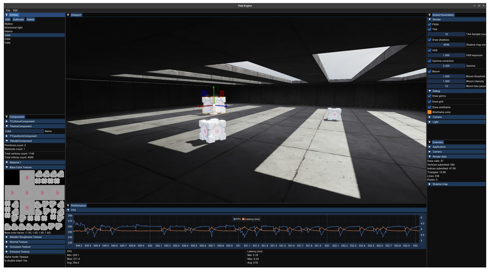

# Real Engine

Real Engine is my personal project where I aim to create a game engine from scratch. This project serves as a platform for me to practice OpenGL, explore graphical programming, and experiment with building a robust and scalable software architecture.



---

## Build Instructions

### Compiler
This project is built with **GCC 15.2.1**. From time to time I fix compilation for the MSVC compiler.

### Requirements
- CMake >= 3.25
- GCC >= 15 / Visual Studio 2026 (MSVC v145)

### Build Steps
1. Create a build directory:
   ```sh
   mkdir build
   cd build
   ```
2. Configure the project:
   ```sh
   cmake ..
   ```
3. Build the executable:
   ```sh
   make -j
   ```
4. Run the engine:
   ```sh
   ./Real_Engine
   ```
